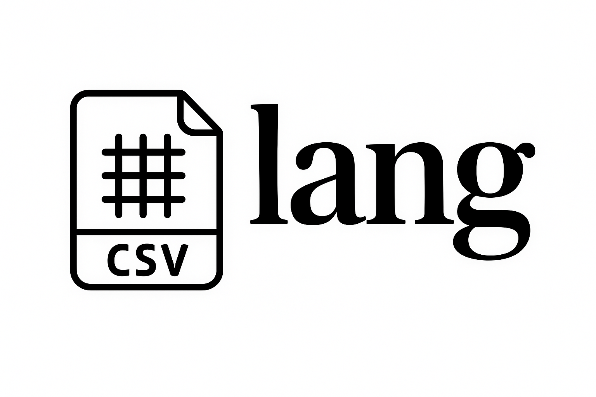

csvlang is a language to interact with CSV files. It is a domain-specific language that allows you to read and add new rows to a CSV file.

Documentation about csvlang commands can be found at [godoc.org](https://pkg.go.dev/github.com/rishabh570/csvlang).

## Contents

1. [Features](#features)
2. [Installation](#installation)
3. [Getting Started](#getting-started)
4. [Examples](#examples)
5. [Running Tests](#running-tests)
6. [Contributing](#contributing)
7. [License](#license)

## Features

- Read all or specific rows or columns
- Fill empty cells with any fallback value you want
- Remove duplicate rows
- Built-in functions to calculate the sum, average, and count of values in a column
- Save and export the CSV file as a JSON or CSV file

## Installation

<!-- TODO: add install instructions after figuring out the release process and making it go gettable -->

## Getting Started

1. Clone the project:

```bash
git clone https://github.com/rishabh570/csvlang
```

2. Change to the project directory:

```bash
cd csvlang
```

3. Run the project with your csvlang script path:

```bash
go run main.go --path <path-to-csvlang-script>
```

## Examples
<!-- 
```javascript
import Component from 'my-project'

function App() {
  return <Component />
}
``` -->

To learn more, check out the [documentation](https://pkg.go.dev/github.com/rishabh570/csvlang).

## Running Tests

To run tests, run the following command

```bash
go test ./...
```

## Contributing

Contributions are always welcome!

See `contributing.md` for ways to get started.

## License

[MIT](https://choosealicense.com/licenses/mit/)
